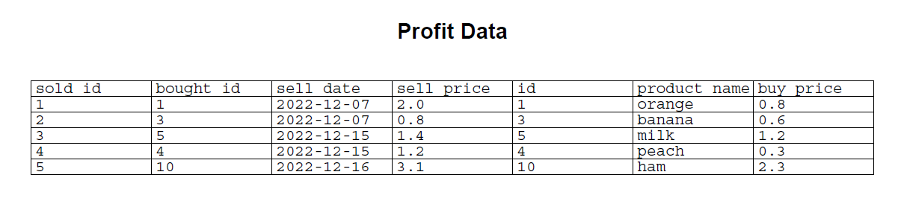

# Report technical elements

## Profit report
In the profit report the bought.csv and sold.csv files are combined in order to calculate the profit (sell_price - buy_price). Also a check is possible on the bought_id (found in the sold.csv file) with the id from the bought.csv file. These two id's should match. In order to facilitate checking the profit file it is possible to create a pdf with the data. Run python profit.py in the command line and a pdf report is created.

Please note that after each new sold product a new pdf report should be generated!

## Monthly actual profit calculation
In the monthly profit calculation you can find the profit for products sold in a certain month e.g. December 2022 (profit = total December sell_price - buy_price of these products sold). However in order to calculate the actual profit of a certain month, you need to substract the cost of expired products in that month.

Run python main.py report-profit --date 2022-12 (or the month you want to see) and you get the following (example) outcome: 

Profit from December 2022: 3.3
Actual Profit from December 2022: 2.0

## Forecasting
With the forecast function it is possible to advance time with a chosen number of days in order to get an overview of the products that will expire on that date. This can be useful to determine if you want to discount the products that will expire soon. 

Run python main.py forecast --advancetime 11

These are the results:

OK
| Product Name| Count | Buy Price | Expiration Date |
| ----------- | ----- | --------- | --------------- |
| butter      | 1     | 0.8       | 2022-12-28      |

If there are no products that expire (in this example 2 days from today) the table is empty:

python main.py forecast --advancetime 2 

OK
| Product Name| Count | Buy Price | Expiration Date |
| ----------- | ----- | --------- | --------------- |
|             |       |           |                 |

